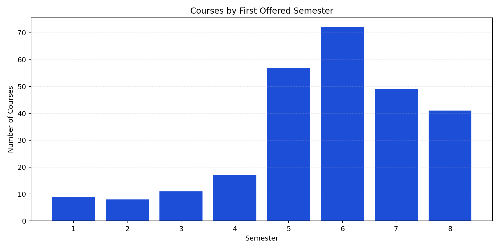
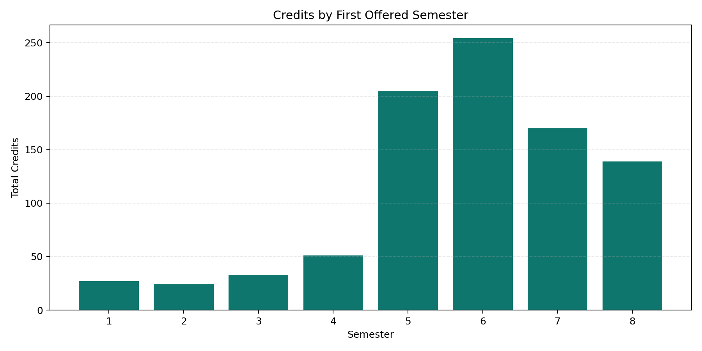
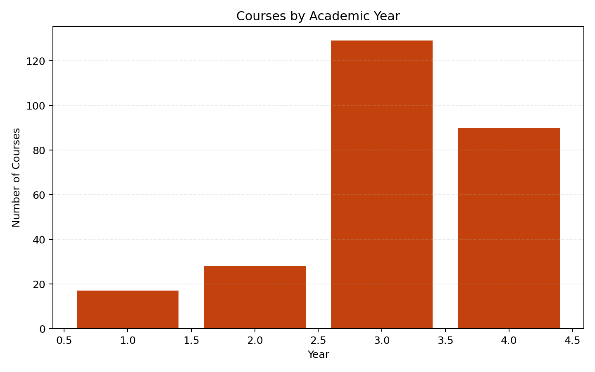
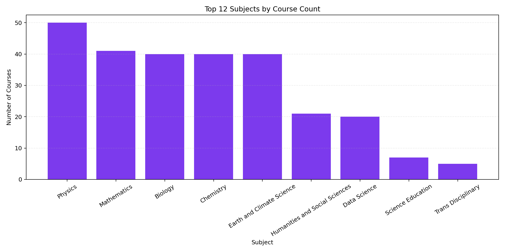
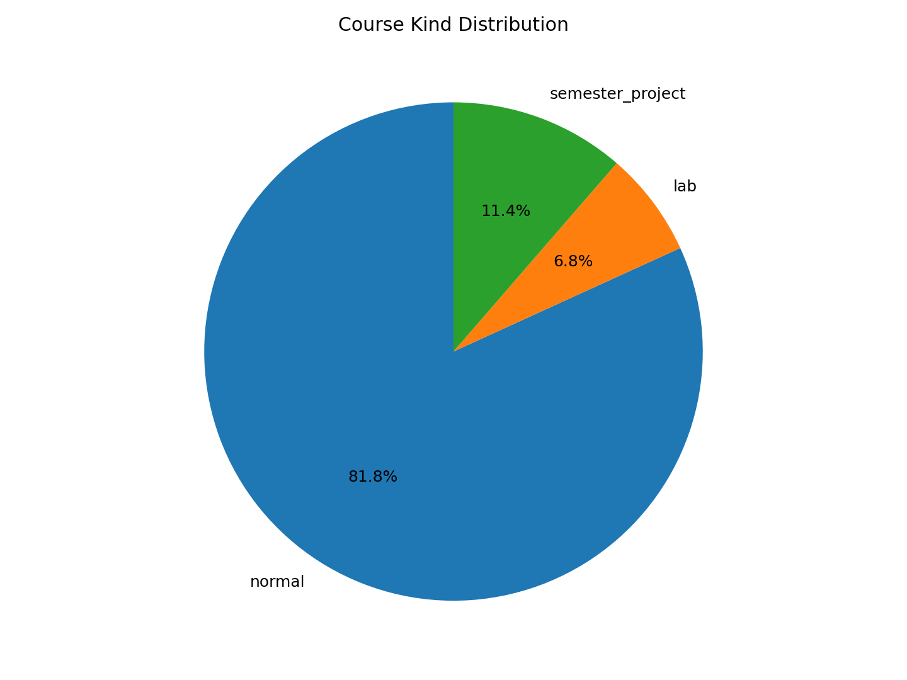
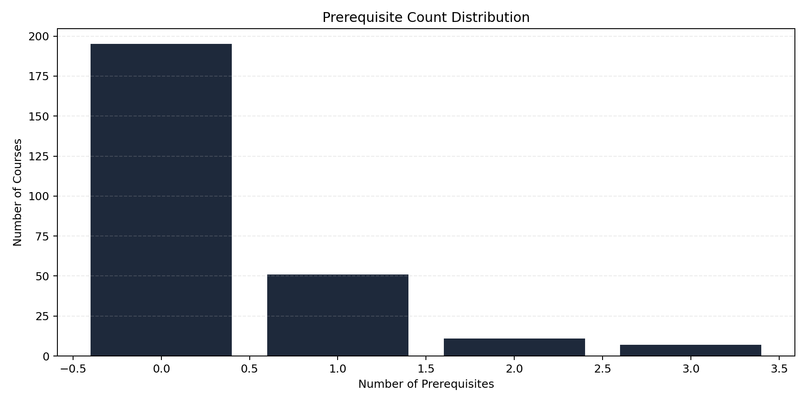
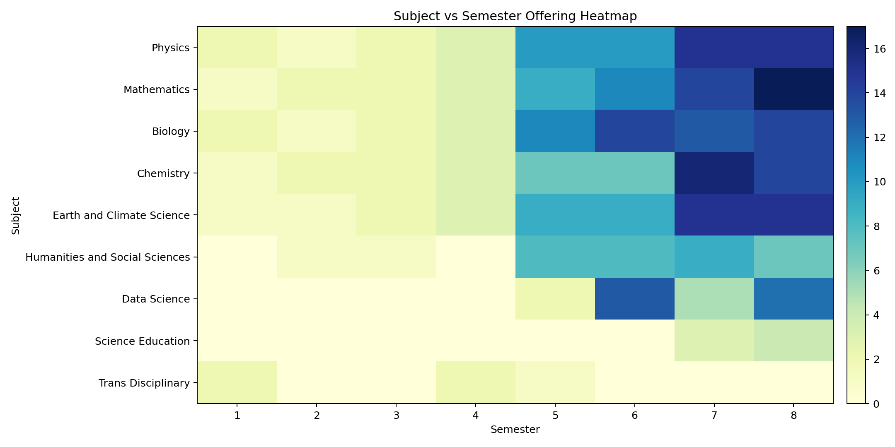

# Curriculum Dashboard Report

Generated: 2026-04-03 23:43:50

## Executive Summary
- Total courses: 264
- Program criteria entries: 16
- Subjects covered: 9
- Prerequisite edges in catalog graph: 94
- Average credits per course: 3.42
- Semester coverage: S1-S8
- Degree target from constraints: 184

## Data Health Snapshot
- Duplicate course codes: 0
- Missing prerequisite links: 0
- Duplicate program entries: 0
- Programs with unknown requirement codes: 0
- Total unknown requirement code hits: 0
- Courses missing semester tags: 0
- Self prerequisite courses: 0

## Subject Coverage
| Subject | Courses |
| --- | --- |
| Physics | 50 |
| Mathematics | 41 |
| Biology | 40 |
| Chemistry | 40 |
| Earth and Climate Science | 40 |
| Humanities and Social Sciences | 21 |
| Data Science | 20 |
| Science Education | 7 |
| Trans Disciplinary | 5 |

## Program Entries
| Program | Entries |
| --- | --- |
| Biology Major | 1 |
| Biology Minor | 1 |
| Chemistry Major | 1 |
| Chemistry Minor | 1 |
| Data Science Major | 1 |
| Data Science Minor | 1 |
| Earth and Climate Science Major | 1 |
| Earth and Climate Science Minor | 1 |
| Humanities and Social Sciences Major | 1 |
| Humanities and Social Sciences Minor | 1 |
| Mathematics Major | 1 |
| Mathematics Minor | 1 |
| Physics Major | 1 |
| Physics Minor | 1 |
| Science Education Major | 1 |
| Science Education Minor | 1 |

## Top Bottleneck Courses
| course_code | course_name | in_degree | direct_dependents | all_downstream | betweenness |
| --- | --- | --- | --- | --- | --- |
| MT2223 | Real Analysis I | 0 | 4 | 12 | 0.0 |
| EC3164 | Earth and Planetary Materials | 0 | 5 | 11 | 0.0 |
| PH3124 | Quantum Mechanics-1 | 0 | 6 | 10 | 0.0 |
| MT2213 | Group Theory | 0 | 5 | 9 | 0.0 |
| PH2223 | Thermal & Statistical Physics | 0 | 3 | 8 | 0.0 |
| MT3124 | Real Analysis II | 1 | 2 | 7 | 0.0001 |
| EC3154 | Sedimentology and Stratigraphy | 1 | 5 | 5 | 0.0 |
| MT3234 | Measure Theory and Integration | 1 | 2 | 5 | 0.0001 |
| PH3234 | Statistical Mechanics I | 1 | 4 | 4 | 0.0001 |
| EC3214 | Geo and Cosmochemistry | 1 | 3 | 4 | 0.0 |
| EC3124 | Physics of the Atmosphere | 0 | 3 | 3 | 0.0 |
| EC3224 | Geophysical Fluid Dynamics | 0 | 3 | 3 | 0.0 |

## Plot Gallery
### Courses By First Semester

### Credits By First Semester

### Courses By Year

### Subject Distribution Top

### Kind Distribution

### Prerequisite Count Distribution

### Subject Semester Heatmap

## Merge Readiness Notes
- Student mode and advanced mode tabs are available in the Streamlit dashboard.
- Program options are policy-filtered for the requested IISER major/minor combinations.
- Graph labels, legends, and semester transition summaries are now student-facing and cleaner.
- Run the smoke-check command before merging: `python -m py_compile src/app.py src/graph.py`.
